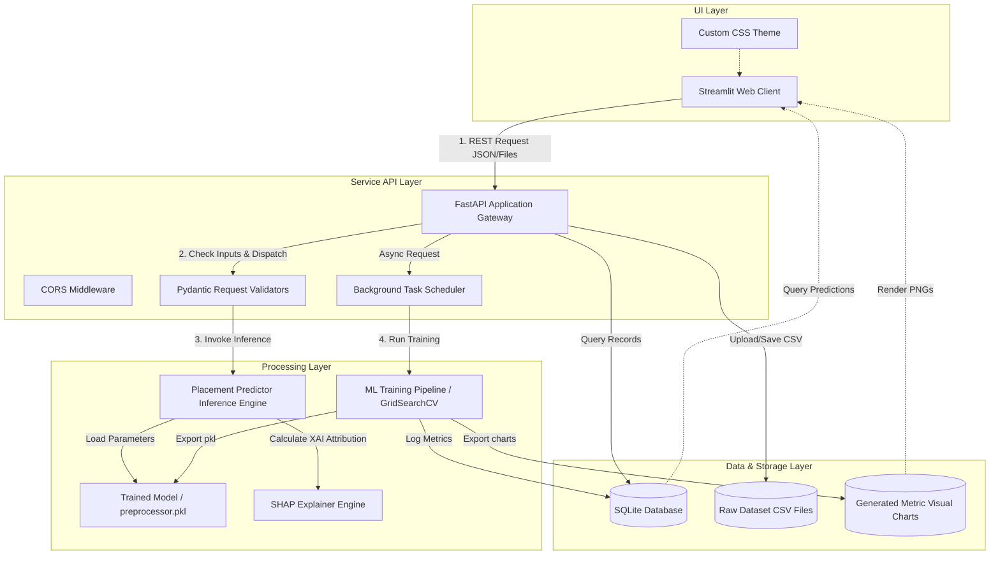
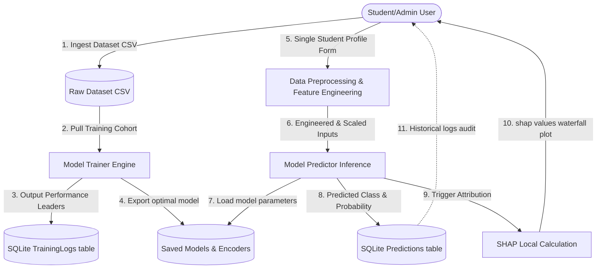
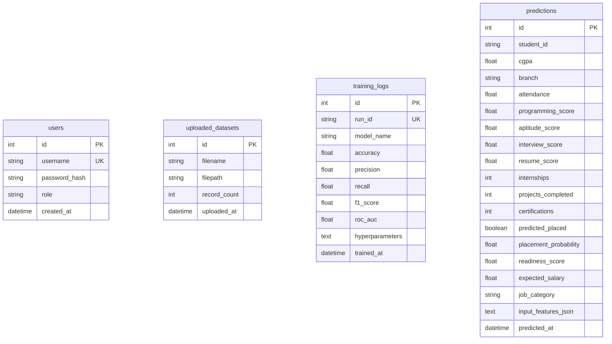
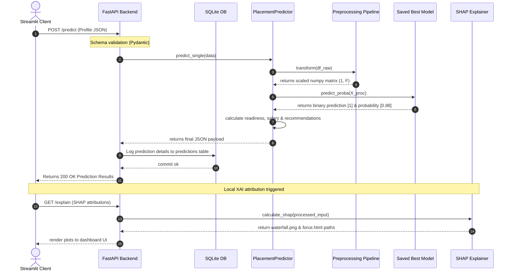
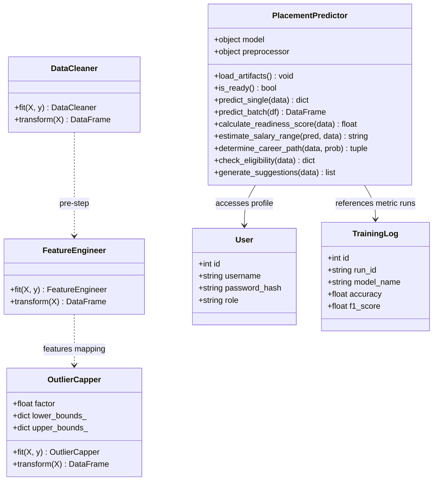

# System Architecture & Design Diagrams

This document contains visual design specifications, block diagrams, and system layouts for the **AI-Powered Student Placement Prediction System**.

---

## 1. System Block Architecture

Describes the overall microservice interaction between the Streamlit client, FastAPI router, SQLite database, and the core ML processing engine.



---

## 2. Data Flow Diagram (DFD Level 1)

Illustrates how data enters, processes through pipelines, updates database records, and returns predictions back to the user.



---

## 3. Entity-Relationship (ER) Diagram

Represents the relational database schema implemented in SQLite using SQLAlchemy.



---

## 4. Use Case Diagram

Defines how the roles (Admin and Student) interact with the functional requirements of the system.

```mermaid
left_to_right_direction
graph TD
    Admin([System Admin])
    Student([Student Profile])
    
    UC1(Upload New Training Dataset)
    UC2(Trigger Model Benchmarking)
    UC3(Inspect Leaderboards & Diagnostic Curves)
    UC4(Input Profile Details for Single Prediction)
    UC5(Upload Resume PDF/TXT to pre-fill form)
    UC6(Examine SHAP Waterfall Explanations)
    UC7(Run Batch Prediction CSV)
    UC8(Reset Databases & Purge Records)

    Admin --> UC1
    Admin --> UC2
    Admin --> UC3
    Admin --> UC8
    
    Student --> UC4
    Student --> UC5
    Student --> UC6
    Student --> UC7
    Student --> UC3
```

---

## 5. Sequence Diagram (Single Prediction Flow)

Displays the chronological workflow of operations executing when a student requests a placement prediction.



---

## 6. Class Diagram

Exposes the relationships and method boundaries between key modules in the backend design.


